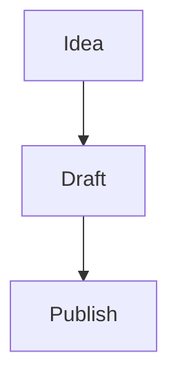
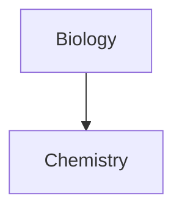

# Markdown syntax

Granite reads and writes plain Markdown. Underneath it is
[CommonMark](https://commonmark.org) with
[GitHub Flavored Markdown](https://github.github.com/gfm/) on top, plus
a small set of extensions that the wider Markdown PKM ecosystem (most
prominently Obsidian) has settled on. Every file remains readable in
any other Markdown tool — the extensions are additive.

This page is a reference of every supported construct.

## Headings

Use 1–6 leading `#` for H1 through H6:

```md
# H1
## H2
### H3
#### H4
##### H5
###### H6
```

Setext-style underline headings (`===`, `---`) are accepted as input
but Granite always writes ATX (`#`) form.

The Outline panel and the Quick Switcher's heading suggestions read
these.

## Paragraphs and line breaks

A blank line separates paragraphs. The behaviour of a single newline
depends on *Settings → Editor → Strict line breaks*:

| Strict line breaks | Single `\n` | Two trailing spaces + `\n` | Double `\n` |
|--------------------|-------------|----------------------------|-------------|
| Off *(default)* | Paragraph break | Paragraph break | Paragraph break |
| On | Soft-wrap (joined) | `<br>` inside paragraph | Paragraph break |

`Shift+Enter` always inserts a hard line break (`<br>`) regardless of
the setting.

## Inline formatting

| Style | Syntax | Hotkey |
|-------|--------|--------|
| **Bold** | `**text**` or `__text__` | `Mod+B` |
| *Italic* | `*text*` or `_text_` | `Mod+I` |
| ***Bold + italic*** | `***text***` | — |
| ~~Strikethrough~~ | `~~text~~` (GFM) | — |
| ==Highlight== | `==text==` | — |
| `Inline code` | `` `text` `` | `` Mod+` `` |

Escape a special character by prefixing with `\`: `\*`, `\_`, `\#`,
`` \` ``, `\|`, `\~`.

For inline code containing a backtick, double up the fence:
`` ``code with ` inside`` ``.

## Lists

### Unordered list

```md
- One
- Two
  - Nested two
- Three
```

`-`, `*`, or `+` all work. Nest by indenting.

### Ordered list

```md
1. First
2. Second
3. Third
```

`1.` or `1)` are accepted. The renderer ignores the actual numbers
and renumbers visually — but the source text is preserved on disk.

### Task list

```md
- [ ] Open task
- [x] Completed task
- [?] Custom marker
- [-] Cancelled
```

`[x]` is the standard "done" marker. Any non-space character inside
the brackets flags the task as non-default. Clicking the checkbox in
Reading view or Live Preview toggles between `[ ]` and `[x]` and
writes the change to disk.

### Nested lists

Indent with `Tab` and outdent with `Shift+Tab`. Mix bullet types
freely; indentation determines nesting.

## Blockquote

```md
> A quote.
> > Nested quote.
```

A blockquote whose first line begins with `[!type]` is a **callout** —
see [the dedicated callouts section](#callouts) below.

## Horizontal rule

Three or more `-`, `*`, or `_` on a line by themselves:

```md
---
```

Spaces between the characters are allowed (`- - -`).

## Code blocks

Fenced with three or more backticks or three or more tildes:

````md
```javascript
console.log("hello");
```

~~~python
print("hello")
~~~
````

The optional language token after the opening fence enables syntax
highlighting. For code blocks that contain a code block, use four or
more fence characters on the outer block, or mix backticks and tildes.

## Tables (GFM)

```md
| Col A | Col B | Col C |
| :---- | :---: | ----: |
| left  | mid   | right |
| 1     | 2     | 3     |
```

The header divider row controls alignment:

- `:---` — left
- `:---:` — center
- `---:` — right

Leading and trailing pipes are optional. Cells need not be perfectly
aligned. Use `\|` to include a literal pipe inside a cell.

Right-click a table in Live Preview for *Insert column / Insert row /
Sort / Move column / Delete column / Delete row*. The Command palette
has *Insert table* which drops a 2 × 2 skeleton at the cursor.

## Math (LaTeX via MathJax)

| Form | Syntax |
|------|--------|
| Block | `$$ ... $$` on its own lines |
| Inline | `$...$` inside text |

```md
The Pythagorean theorem: $a^2 + b^2 = c^2$.

$$
\int_0^\infty e^{-x^2} \, dx = \frac{\sqrt{\pi}}{2}
$$
```

To use a literal dollar sign in body text, escape it: `\$5`.

## Diagrams (Mermaid)

Use a fenced code block tagged `mermaid`:

````md

````

To make a Mermaid node text into a vault-internal link, attach the
`internal-link` class:

````md

````

Internal links inside Mermaid diagrams do **not** appear as edges in
the Graph view. This is by design.

## Footnotes

```md
This sentence has a footnote.[^1]

[^1]: The text of the footnote.
[^longnote]: Footnotes can span multiple lines
  by indenting continuation lines two spaces.
```

Inline footnotes render only in Reading view:

```md
Some text. ^[This is the inline footnote text.]
```

The Footnotes view in the right sidebar lists every footnote
definition in the current note.

## Comments

`%% ... %%` denotes a comment. Comments are visible only in Editing
view — Reading view, exports, and published output omit them entirely.

```md
This is %%inline%% commentary.

%%
A block comment that
spans multiple lines.
%%
```

## Internal links (wikilink and Markdown)

Granite accepts both wikilinks and Markdown-form links. By default it
writes wikilinks; switch via *Settings → Files and links → Use
\[\[Wikilinks\]\]*.

```md
[[Three laws of motion]]            ← wikilink
[[Three laws of motion.md]]         ← extension optional
[[Three laws of motion|3 laws]]     ← display-text override
[[Note#Heading]]                    ← link to a heading
[[Note#H1#H2]]                      ← nested heading
[[Note#^id]]                        ← link to a block by ID
[Three laws of motion](Three%20laws%20of%20motion.md)
```

Spaces in Markdown-form URLs must be percent-encoded (`%20`) or
wrapped in `< ... >`.

These characters are reserved inside link targets and may not appear
literally: `# | ^ : %% [[ ]]`.

See [Links and embeds](./links-and-embeds.md) for the full reference.

## Embeds

Prefix any internal link with `!` to embed its content inline:

```md
![[Image.png]]              embed image
![[Image.png|320]]          embed image, width 320
![[Image.png|320x180]]      embed image, width 320 height 180
![[Document.pdf]]           embed PDF
![[Document.pdf#page=3]]    open at page 3
![[Document.pdf#height=400]] embed at fixed pixel height
![[Audio.mp3]]              embed audio player
![[Note]]                   embed full note inline
![[Note#Heading]]            embed a section
![[Note#^id]]                embed a single block
![[Brainstorm.canvas]]       embed an interactive canvas
![[Books.base]]              embed a base's first view
![[Books.base#Reading list]] embed a specific base view
```

External image embeds work in Markdown form too:

```md

```

## Properties (frontmatter)

A YAML block at the very top of the file, fenced by `---`:

```yaml
---
title: A Note
tags:
  - example
aliases:
  - alt name
date: 2024-01-01
favorite: true
---
```

JSON between `---` fences is also accepted but converted to YAML on
save. See [Properties and tags](./properties-and-tags.md) for types,
the inline editor, and the Properties panel.

## Tags

`#tag` anywhere in the body:

```md
This note is about #philosophy and #zettelkasten/method.
```

Or in YAML:

```yaml
---
tags:
  - philosophy
  - zettelkasten/method
---
```

Rules:

- Letters, digits, `_`, `-`, `/`, and common Unicode (including emoji)
  are allowed.
- All-numeric tags are invalid (`#1984` no; `#y1984` yes).
- Spaces are not allowed — use camelCase or kebab-case.
- Tags are matched case-insensitively but display in their original
  casing.
- `/` nests tags (`#inbox/to-read` is a child of `#inbox`).

In YAML, the `tags` property is a list of tag names without the `#`
prefix — write `- book`, not `- #book`.

## Block IDs

A standalone `^id` token marks a block so other notes can link to it
via `[[Note#^id]]`.

```md
The quick purple gem dashes through the paragraph. ^my-quote

> A blockquote may carry an ID like this:

^my-quote
```

Rules:

- IDs may contain Latin letters, digits, and dashes.
- For paragraphs: place `^id` at the end of the line, preceded by a
  space.
- For structured blocks (lists, blockquotes, callouts, tables): place
  `^id` on its own line with a blank line before and after.
- For list items: place `^id` on the same line as the bullet.

Auto-generated IDs are 6-character random hex.

## Callouts

A **callout** is a styled blockquote whose first line is `> [!type]`.

```md
> [!info] Optional custom title
> Body content with **Markdown**, [[wikilinks]], and ![[embeds]].
```

- The type token `[!type]` must be at the very start of the first
  line.
- Optional title text follows the type on the same line.
- Add `+` for foldable, expanded by default: `[!faq]+`
- Add `-` for foldable, collapsed by default: `[!faq]-`

### Built-in types

| Type | Aliases |
|------|---------|
| `note` *(default)* | — |
| `abstract` | `summary`, `tldr` |
| `info` | — |
| `todo` | — |
| `tip` | `hint`, `important` |
| `success` | `check`, `done` |
| `question` | `help`, `faq` |
| `warning` | `caution`, `attention` |
| `failure` | `fail`, `missing` |
| `danger` | `error` |
| `bug` | — |
| `example` | — |
| `quote` | `cite` |

The type identifier is case-insensitive. An unrecognised type falls
back to `note`.

### Title-only callouts

Omit the body for a single-row callout:

```md
> [!tip] Title-only callout
```

### Nested callouts

Add one extra `>` per nesting level:

```md
> [!question] Outer
> > [!todo] Middle
> > > [!example] Inner
```

### Custom callout types via CSS

Define a new type in a CSS snippet — see [Themes and CSS
snippets](./themes-and-snippets.md):

```css
.callout[data-callout="tldr-2"] {
  --callout-color: 100, 200, 255;       /* RGB */
  --callout-icon: lucide-clipboard-check;
}
```

### Inserting callouts

- Command palette → *Insert callout* (inserts a `> [!note]` skeleton
  with the cursor on the type token).
- Right-click in editor → *Insert → Callout*.
- With a selection: *Insert callout* wraps the selection in a callout.

Right-click a callout title bar to pick a different type from the
list.

## Slash commands

Inside the editor, type `/` at the start of a line or after
whitespace to open a fuzzy command popover identical to the Command
palette. Press `Esc` or `Space` to dismiss without invoking; arrow
keys navigate; `Enter` runs.

## What does not render Markdown

Markdown inside HTML elements is not parsed. So `<div>**not
bold**</div>` shows the asterisks literally. This is a deliberate
parser constraint and is consistent across the editor and Reading
view.

## See also

- [Links and embeds](./links-and-embeds.md) — full details on internal
  linking.
- [Properties and tags](./properties-and-tags.md) — frontmatter,
  types, and the inline editor.
- [Reference → File formats](../reference/file-formats.md) — the
  formal grammar.

---

[← Editor modes](./editor.md) · [Index](./README.md) · [next: Links and embeds →](./links-and-embeds.md)
