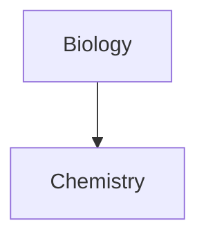

# 07 — Markdown syntax (Obsidian-flavored)

The editor parses three flavors of Markdown layered on top of each other:

1. **CommonMark** — base spec.
2. **GitHub Flavored Markdown** (GFM) — tables, task lists, strikethrough, autolinks.
3. **Obsidian extensions** — wikilinks, embeds, block IDs, callouts, comments, highlights, properties, math.

This document enumerates every supported construct.

## 7.1 Paragraphs and line breaks

A blank line separates paragraphs. Multiple blank lines collapse to a single paragraph break.

Single newline behavior depends on **Strict line breaks** setting:

| Strict line breaks | Single `\n` | Two trailing spaces + `\n` | Double `\n` |
|--------------------|-------------|----------------------------|-------------|
| Off (default)       | renders as paragraph break | renders as paragraph break | renders as paragraph break |
| On                  | renders as soft-wrap (joined) | renders as `<br>` inside paragraph | renders as paragraph break |

`Shift+Enter` always inserts a hard line break (`<br>`) regardless of the setting.

Multiple adjacent spaces collapse to one in rendered output. Use `&nbsp;` or `<br>` HTML for explicit spacing.

## 7.2 Headings

ATX style with 1–6 leading `#`. Setext (`===` underline) is **not** treated as an ATX H1 in some places — prefer ATX in this implementation.

```md
# H1
## H2
### H3
#### H4
##### H5
###### H6
```

The Outline panel and the Quick Switcher's heading-link suggestions read these.

## 7.3 Inline formatting

| Style | Syntax | Notes |
|-------|--------|-------|
| Bold | `**text**` or `__text__` | Hotkey: `Ctrl/Cmd+B`. |
| Italic | `*text*` or `_text_` | Hotkey: `Ctrl/Cmd+I`. |
| Bold + italic | `***text***` or `___text___` | |
| Strikethrough | `~~text~~` | GFM. |
| Highlight | `==text==` | Obsidian extension; renders with `--text-highlight-bg`. |
| Inline code | `` `text` `` | Use double backticks `` ``code with ` inside`` `` for code containing single backticks. |
| Bold w/ nested italic | `**Bold and _italic_**` | |

Escape any of these to render literal characters by prefixing with `\`. Common escaped characters: `\*`, `\_`, `\#`, `` \` ``, `\|`, `\~`.

## 7.4 Lists

### Unordered list

Bullets `-`, `*`, or `+` followed by a space. Nest by indenting. The default rendered marker is a small filled disc (`--list-bullet-*` variables).

### Ordered list

`1.` or `1)` followed by space. Continuation numbers are not enforced (the renderer ignores the actual number) but the source-text number is preserved.

### Task list

```md
- [ ] open task
- [x] completed task
- [?] custom marker
- [-] another marker
```

The character inside `[ ]` is a *task state*. `[x]` is "done"; any non-empty character also flags the item as non-default. The Tasks community plugin (out of scope core, but the syntax must be preserved) uses single-character codes here; the core editor renders any non-space character as "completed-style" by default. Clicking a task checkbox in Reading view or Live Preview toggles between space and `x`.

### Nested lists

Mix list types freely; indentation determines nesting. Indent / outdent with `Tab` / `Shift+Tab` while a list item is selected.

## 7.5 Block elements

### Blockquote

Lines prefixed with `> `. Nested quotes use `>> `. A blockquote that begins with `[!type]` becomes a **callout** — see `08_callouts.md`.

### Horizontal rule

Three or more `-`, `*`, or `_` on a line by themselves. Spaces between them are allowed (`- - -`).

### Code block

Fenced with three or more `` ` `` or `~~~`. Optional language token after the opening fence enables syntax highlighting (PrismJS in Reading view, CodeMirror's highlighter in Editing view — slight cosmetic differences are tolerated).

For nested code blocks (documenting code blocks), use four or more fence chars on the outer block, or mix backticks and tildes.

## 7.6 Tables (GFM)

```md
| Col A | Col B |
| ----- | ----- |
| 1     | 2     |
```

Column alignment with `:--`, `:--:`, `--:` in the header divider row. The leading and trailing pipes are optional. Cells need not be perfectly aligned. The header divider row must contain at least two `-` per column.

Right-click a table in Live Preview for *Insert column / Insert row / Sort / Move column / Delete column / Delete row*. Insert via the *Insert table* command (Command palette) which inserts a 2×2 skeleton.

Use `\|` to include a literal pipe inside a cell. Inside a cell, use `\|` when separating wikilink alias and display text or image alias and resize.

## 7.7 Math (LaTeX via MathJax)

- **Block**: enclosed in `$$ ... $$` on its own lines.
- **Inline**: `$...$` inside text.

Money should be escaped (`\$`) inside Markdown body so it isn't parsed as math.

Supported packages: standard MathJax LaTeX extensions. The renderer must allow custom MathJax macros via configuration.

## 7.8 Diagrams (Mermaid)

Fenced code block tagged `mermaid`:

````md

````

To make node text into a vault-internal link, attach the `internal-link` class:

````md

````

Internal links from Mermaid diagrams do **not** appear in the Graph view's edges (this is by design and must be replicated).

## 7.9 Footnotes

```md
This sentence has a footnote.[^1]

[^1]: The text of the footnote.
[^longnote]: Footnotes can span multiple lines
  by indenting continuation lines two spaces.
```

Inline footnotes: `Some text. ^[This is the footnote text.]` — these only render in Reading view, not Live Preview.

The Footnotes view sidebar lists every footnote definition for navigation.

## 7.10 Comments

`%% ... %%` denotes a comment. Single-line: `This is %%inline%% comment.`. Multi-line:

```md
%%
A block comment that
spans multiple lines.
%%
```

Comments are visible only in Editing view. Reading view, Publish, and exports omit them entirely.

## 7.11 Internal links (wikilink and Markdown)

```md
[[Three laws of motion]]            ← wikilink
[[Three laws of motion.md]]         ← extension optional for .md
[[Three laws of motion|3 laws]]     ← display-text override
[[Note#Heading]]                    ← link to a heading
[[Note#H1#H2]]                      ← nested heading
[[Note#^id]]                        ← link to a block by ID
[Three laws of motion](Three%20laws%20of%20motion.md)   ← Markdown form
```

URL-encode spaces in the Markdown form (`%20`). Wrap the URL in `< ... >` to avoid escaping. Default new-link format is wikilink unless *Settings → Files and links → Use \[\[Wikilinks\]\]* is off. See `09_links_embeds_aliases.md` for the complete spec.

Characters disallowed in link targets (because they're reserved): `# | ^ : %% [[ ]]`.

## 7.12 Embeds

Prefix any internal link with `!`:

```md
![[Image.png]]              embed image
![[Image.png|320]]          embed image, width 320
![[Image.png|320x180]]      embed image, width 320 height 180
![[Document.pdf]]           embed PDF
![[Document.pdf#page=3]]    open at page 3
![[Document.pdf#height=400]] embed at fixed pixel height
![[Audio.mp3]]              embed audio player
![[Excerpt.ogg]]            audio
![[Note]]                   embed full note inline
![[Note#Heading]]            embed a section
![[Note#^id]]                embed a single block
```

External-image embeds can be Markdown-form: ``.

## 7.13 Properties (frontmatter)

A YAML block at the very top of the file fenced with `---`:

```yaml
---
title: A Note
tags:
  - example
aliases:
  - alt name
date: 2024-01-01
---
```

JSON variant is also accepted (`{ ... }` between the `---` fences) but is converted on save to YAML. See `10_properties_and_tags.md`.

## 7.14 Tags

`#word` anywhere in the body, plus the YAML `tags:` list. Tags are case-insensitive but display preserves original casing. Forbidden characters: spaces, leading-only digits (numerics-only tags are not valid; `#1984` no, `#y1984` yes). Allowed: letters, digits, `_`, `-`, `/`, common Unicode (emoji etc.).

## 7.15 Block IDs

A standalone `^id` token appended to a paragraph or placed under a structured block creates a block reference target:

```md
The quick purple gem dashes through the paragraph. ^my-quote

> A blockquote may carry an ID like this:

^my-quote
```

For paragraphs: place `^id` at the end of the line preceded by a space.

For structured blocks (lists, blockquotes, callouts, tables): place `^id` on a separate line with a blank line before and after.

For list-item targets: place `^id` on the bullet line itself.

IDs may contain Latin letters, digits, and dashes.

## 7.16 What does **not** render Markdown

Inside HTML elements, Markdown is intentionally **not** parsed. So `<div>**not bold**</div>` shows the asterisks. This is a deliberate design constraint for parser performance and predictability.

## 7.17 Comments inside YAML

YAML accepts `# yaml comment` in frontmatter. These are ignored by the property parser.

## 7.18 Slash commands

Inside the editor, typing `/` at the start of a line or after whitespace opens a fuzzy command popover identical in behavior to the Command palette. Press Esc or Space to dismiss without invoking. See `13_command_palette_search_quickswitcher.md`.